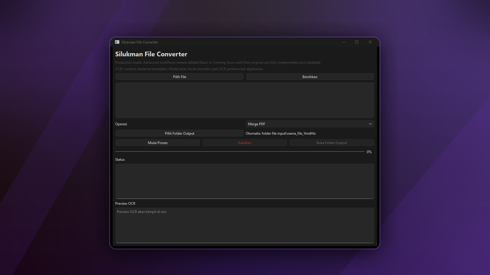

# Silukman File Converter



Silukman File Converter is a Windows desktop application for file conversion, PDF operations, and OCR. It is built with Python, PySide6, PyInstaller, and PaddleOCR.

```text
Version : 1.0.1
Channel : production
Status  : READY_FOR_PRODUCTION
```

Production readiness is decided by evidence from the QA gate, not by assumption.

## Features

Production-ready workflows:

- PDF to image
- Image to PDF
- Merge PDF
- Split PDF
- Compress PDF, with `not_effective` when the compressed file is not smaller
- OCR image
- OCR scanned PDF
- Protect PDF with a user-provided password
- Unlock PDF with a user-provided password for encrypted PDFs
- Lossless DOCX -> PDF -> DOCX round-trip for PDFs created by this application
- Recoverable PDF operations: PDF outputs keep original-source recovery data where practical, and PDF -> Word/Excel/PowerPoint -> PDF can restore the original PDF byte-for-byte for files produced by this application.

Basic workflows:

- Word to PDF (Basic Text)
- Excel to PDF (Basic Text)
- PowerPoint to PDF (Basic Text)
- PDF to Word (Basic Text)
- PDF to Excel (Basic Text)
- PDF to PowerPoint (Basic)
- Edit PDF (Basic)
- Watermark PDF (Basic)
- Rotate PDF (Basic)
- Crop PDF (Basic)
- Redact PDF (Basic)
- Stamp PDF, which adds a visible stamp and is not certificate-backed digital signing

Coming Soon workflows:

- Translate PDF
- AI Summarizer
- PDF/A validation
- Real digital signature

## Portable EXE

Use the portable executable after extracting the release package:

```powershell
dist\silukman_file_converter.exe
```

Notes:

- Do not run the executable directly from inside a ZIP archive.
- The application is a Windows GUI executable and should not open a terminal during normal launch.
- The main window is not configured as always-on-top.
- Output files are written to user-writable output folders selected by the application workflow.

## Installer

The Windows installer is built with Inno Setup:

```powershell
.\build_installer.ps1
```

Expected installer artifact:

```text
dist\silukman_file_converter_setup.exe
```

The installer QA flow validates installation, shortcuts, application launch, uninstall behavior, and leftover files:

```powershell
python tools\installer_build_qa.py --run-installer-test
```

## OCR First Run

PaddleOCR may need local models before the first OCR run. The application checks OCR readiness before processing:

1. Detect PaddleOCR runtime availability.
2. Check local OCR model/cache availability.
3. Check internet availability when setup is needed.
4. Run a small OCR health check.
5. Continue OCR only when runtime and model state are safe.

If OCR cannot run because the model is not available locally, the user-facing status is:

```text
ocr_model_not_ready
```

User message:

```text
Model OCR belum tersedia. Hubungkan internet lalu jalankan OCR sekali untuk menyiapkan model.
```

After the first successful setup, OCR image and OCR scanned PDF workflows are expected to work offline from the local cache.

## Supported Operations

The automated EXE matrix validates supported operations with sample files from `samples/`:

- Merge PDF
- Compare PDF
- Split PDF
- Compress PDF
- PDF to Word (Basic Text)
- PDF to PowerPoint (Basic)
- PDF to Excel (Basic Text)
- Edit PDF (Basic)
- PDF to JPG
- PDF to PNG
- Stamp PDF
- Watermark PDF (Basic)
- Rotate PDF (Basic)
- Unlock PDF
- Protect PDF
- Organize PDF
- Repair PDF
- Page numbers
- OCR PDF/Image
- Redact PDF (Basic)
- Crop PDF (Basic)
- PDF Forms
- JPG/PNG to PDF
- Scan to PDF
- Word to PDF (Basic Text)
- PowerPoint to PDF (Basic Text)
- Excel to PDF (Basic Text)
- Excel to CSV
- Excel to JSON
- HTML to PDF
- CSV to Excel when a CSV sample exists
- JSON to Excel when a JSON sample exists

Unsupported or disabled operations are reported as skipped, blocked, `not_configured`, or `not_validated`; they are not converted into fake success results.

## Known Limitations

- DOCX -> PDF -> DOCX round-trip is lossless only when the PDF was created by this application, because the original DOCX is stored as an internal PDF attachment for recovery.
- Word to PDF visual fidelity uses Microsoft Word COM automatically when Microsoft Word is installed, then LibreOffice when `soffice` is available; otherwise it falls back to Basic Text PDF generation while still preserving the original DOCX for round-trip recovery.
- Office-to-PDF is Basic Text conversion unless a layout-preserving engine such as LibreOffice is configured and validated.
- Edit PDF, Watermark, Rotate, Crop, and Redact still use basic/default parameters.
- Stamp PDF is a visible stamp workflow, not a certificate-backed digital signature.
- Translate PDF, AI Summarizer, PDF/A validation, and real digital signatures are Coming Soon.
- Compress PDF can return `not_effective` when the output is not smaller than the original file.
- `success_short_text` is not an error for intentionally short dummy documents.

## Development Setup

```powershell
python -m venv venv
venv\Scripts\activate
pip install -r requirements.txt
```

Run from source:

```powershell
python app\main.py
```

## Build

Standard build:

```powershell
.\build.ps1
```

Optimized build:

```powershell
.\build_optimized.ps1
```

Build a deterministic production release package:

```powershell
.\build_release_package.ps1 -Channel production -Version 1.0.1
```

Validate a release package:

```powershell
.\validate_release_package.ps1 -Channel production -Version 1.0.1
```

## Production QA

Automated QA:

```powershell
python tools\production_qa.py
```

EXE matrix:

```powershell
python tools\production_qa.py --run-exe-matrix
```

Run a specific matrix group or operation:

```powershell
python tools\production_qa.py --run-exe-matrix --exe-matrix-group pdf
python tools\production_qa.py --run-exe-matrix --exe-matrix-group image
python tools\production_qa.py --run-exe-matrix --exe-matrix-group office
python tools\production_qa.py --run-exe-matrix --exe-matrix-group ocr
python tools\production_qa.py --run-exe-matrix --exe-matrix-group security
python tools\production_qa.py --run-exe-matrix --exe-matrix-op pdf_to_png --exe-op-timeout 60
```

Generate Windows evidence on the current machine:

```powershell
python tools\windows_qa_runner.py --tester "Your Name" --run-defender-scan --run-ocr-online --run-ocr-offline
```

Build a no-Python clean Windows validation package:

```powershell
python tools\build_clean_windows_package.py
```

Run clean Windows validation inside the validation package:

```powershell
powershell -ExecutionPolicy Bypass -File .\qa\clean_windows_runner.ps1
```

Import clean Windows evidence back into the main workspace:

```powershell
python tools\import_clean_windows_validation.py path\to\clean_windows_validation.json
```

Validate manual/evidence QA:

```powershell
python tools\manual_qa_checklist.py validate output\production_qa\manual_qa_filled.json
```

Final production gate:

```powershell
python tools\production_qa.py --resume --run-exe-matrix --manual-report output\production_qa\manual_qa_filled.json
```

The final decision is one of:

```text
READY_FOR_PRODUCTION
PRODUCTION_CANDIDATE
NOT_READY_FOR_PRODUCTION
```

`READY_FOR_PRODUCTION` requires:

- automated QA pass
- full EXE matrix pass
- OCR online and offline validation pass
- installer validation pass
- clean Windows no-Python validation pass
- no blocked checks
- no missing evidence
- no timeout

## Release Files

Important release metadata:

- `VERSION`
- `RELEASE_MANIFEST.json`
- `CHANGELOG.md`
- `LICENSE`
- `docs/production_release_checklist.md`
- `docs/windows_production_qa_pipeline.md`
- `docs/release_architecture.md`
- `docs/release_notes_template.md`

## Troubleshooting

OCR model is not ready:

- Connect to the internet.
- Run OCR once to prepare the model/cache.
- Close the application.
- Run OCR again offline to confirm cache behavior.

Installer cannot be built:

- Install Inno Setup 6.
- Re-run `.\build_installer.ps1`.
- Re-run `python tools\installer_build_qa.py --run-installer-test`.

Output cannot be saved:

- Use a user-writable folder such as Documents or Desktop.
- Avoid writing directly into Program Files as a standard user.

## License

This project is released under the MIT License. See `LICENSE`.
